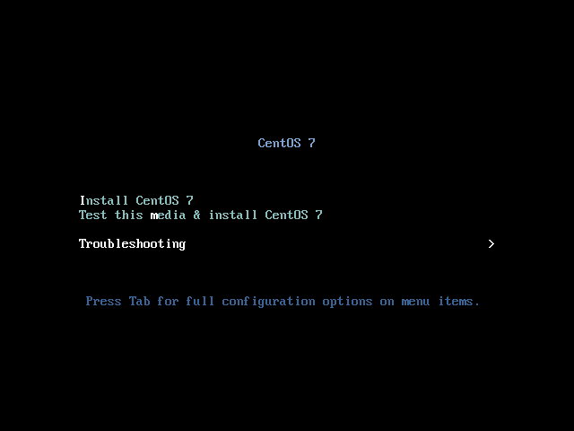
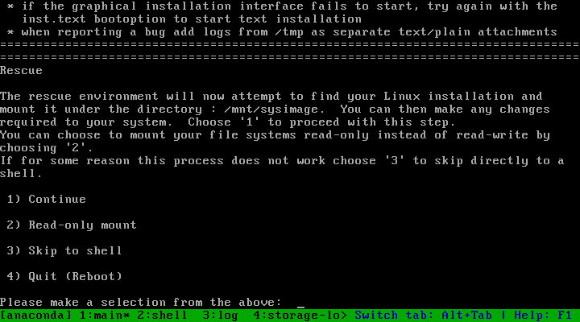
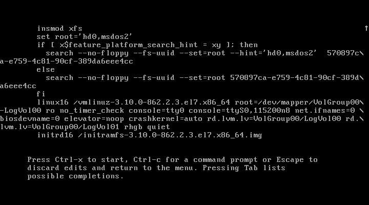

## Занятие 7. Загрузка системы  
### Содержание
1. [Описание занятия](#description)  
2. [Домашнее задание](#homework)  
3. [Справочная информация](#info)  
4. [Выполнение](#exec)  
    - 4.1 [Вход в систему без пароля](#nopass)  
        - [Сброс пароля root с помощью установочного диска](#bootcd)  
        - [Сброс пароля root с помощью rd.break](#rdbreak)  
    - 4.2 [LVM, переименование VG](#lvm)
    - 4.3 [Добавление модуля в initrd](#initrd)       

## 1. Описание занятия <a name="description"></a>
### Цели
- загрузка системы;  
- разница между `BIOS`/`UEFI`;  
- знакомство с `GRUB2` и его настройка;    
- управление `initrd` с помощью `dracut`;  
- восстановление сломанного загрузчика.  

### Краткое содержание    
- порядок загрузки системы;  
- `GRUB 2`;  
- параметры ядра;  
- `initrd`;  
- `dracut`.  

### Результаты  
Студент может сконфигурировать `GRUB2`, изменить порядок и параметры загрузки.

## 2. Домашнее задание  <a name="homework"></a>
### Постановка задачи  
Работа с загрузчиком
1) Попасть в систему без пароля несколькими способами.  
2) Установить систему с `LVM`, после чего переименовать `VG`.  
3) Добавить модуль в `initrd`.  
4) Сконфигурировать систему без отдельного раздела `/boot`, а только с `LVM`.  
[Репозиторий](https://yum.rumyantsev.com/centos/7/x86_64/) с пропатченным `GRUB2`.  
`PV` необходимо инициализировать с параметром `--bootloaderareasize 1m`.  

Описать действия, описать разницу между методами получения шелла в процессе загрузки.  
Где получится - используем script, где не получается - словами или копипастой описываем действия.

## 3. Справочная информация <a name="info"></a>  

Упрощенная схема процесса загрузки:  
1) Система BIOS или прошивка загрузки загружают и запускают загрузчик системы.  
2) Загрузчик системы отыскивает образ ядра на диске, загружает его в память и запускает.  
3) Ядро выполняет инициализацию устройств и их драйверов.  
4) Ядро монтирует корневую файловую систему.  
5) Ядро запускает команду `init` с идентификатором процесса 1. Эта точка является началом пространства пользователя.  
6) Команда `init` приводит в действие остальные системные процессы.  
7) В определенный момент команда `init` запускает процесс, позволяющий войти в систему.

`dmesg` — это утилита для просмтра и управления кольцевым буфером ядра.


Параметры ядра при загрузке системы можно увидеть так:
```bash
cat /proc/cmdline
```
```console
BOOT_IMAGE=/boot/vmlinuz-3.10.0-957.12.2.el7.x86_64 root=UUID=8ac075e3-1124-4bb6-bef7-a6811bf8b870 ro no_timer_check console=tty0 console=ttyS0,115200n8 net.ifnames=0 biosdevname=0 elevator=noop crashkernel=auto LANG=en_US.UTF-8
```

#### Начальная файловая система
Загрузчик системы загружает архив с модулями драйверов для контроллеров устройств хранения данных в память перед запуском ядра. Во время запуска ядро считывает содержимое архива во временную файловую систему оперативной памяти ( `initramfs` ), монтирует ее в корневой каталог и в пользовательском режиме выполняет передачу управления команде `init` в файловой системе `initramfs`. Затем включенные в состав `initramfs` утилиты позволяют ядру загрузить необходимые модули драйверов для реальной корневой файловой системы. Наконец, утилиты монтируют реальную корневую файловую систему и запускают настоящую команду `init`.

- `initramfs`, начальная файловая система оперативной памяти — реализация, которая использует архив `cpio` в качестве источника для временной файловой системы.  
- `initrd`, начальный диск оперативной памяти — устаревшая реализация, которая применяет образ диска в качестве основы для временной файловой системы.

## 4. Выполнение <a name="exec"></a>  

### 4.1 Вход в систему без пароля  <a name="nopass"></a>  
#### Сброс пароля root с помощью установочного диска <a name="bootcd"></a>  
Этот способ является предпочтительным и избавляет от необходимости редактировать меню `GRUB2` при загрузке.  


<details>
    <summary>Последовательность действий:</summary>

1) Необходимо загрузиться с установочного диска, например, [CentOS-7-x86_64-NetInstall-1908.iso](https://mirror.yandex.ru/centos/7.7.1908/isos/x86_64/CentOS-7-x86_64-NetInstall-1908.iso) ;  

2) в предлагаемом меню нужно последовательно выбрать пункты &laquo;Choose Troubleshooting&raquo; и &laquo;Choose Rescue a CentOS System&raquo; ;  
  
  

3) после подтверждения выбора пункта &laquo;Continue&raquo; появится доступ в командную оболочку.  
  
  

4) Следующим шагом будет изменение корня файловой системы:
```bash
chroot /mnt/sysimage
```
  

5) после чего изменяется пароль супрепользователя:
```bash
passwd
```
и настраивается `SELinux`:
```bash
rm -f /.autorelabel
```
```bash
exit
exit
```

</details>

#### Сброс пароля root с помощью rd.break <a name="rdbreak"></a>  
> Успешно продемострровать выполнение этого пункта домашнего задания используя Vagrant не получилось из-за усеченных образов CentOS, которые он использует, поэтому была проведа ручная установка CentOS 7 на VirtualBox из образа [CentOS-7-x86_64-Minimal-1908.iso](https://mirror.yandex.ru/centos/7.7.1908/isos/x86_64/CentOS-7-x86_64-Minimal-1908.iso).

Сброс пароля `root` с помощью `rd.break` использует `rd.break` для прерывания процесса загрузки, прежде чем управление будет передано из `initramfs` в `systemd`. Недостаток этого метода заключается в том, что он требует больше шагов и включает в себя необходимость редактировать меню `GRUB2` и настраивать `SELinux`.  

- После старта системы необходимо в меню `GRUB2` выбрать ядро для загрузки и нажать `e`;  
- Из строки, которая начинается параметром `linux16` (`linuxefi` для UEFI-систем ), удалить параемтры `rhgb` и `quiet` и в конце строки дописать параметр  
`rd.break enforcing=0`.  
Добавление параметра `inforcing = 0` позволяет исключить трудоемкий процесс перемаркировки `SELinux`. `Initramfs` остановится перед передачей управления ядру Linux, что позволит работать с корневой файловой системой.  
  

- перезагрузить систему с измененными параметрами сочетанием клавиш `CTRL`+`X`, после чего появится приглашение `Initramfs`.  
  

- Пермонтирование файловой системы с возможностью записи:  
```bash
mount -o remount,rw /sysroot
```
- Изменение корневой файловой системы:  
```bash
chroot /sysroot
```
- Изменение пароля суперпользователя:  
```bash
passwd
```
```console
Changing password for user root.
New password:
Retype new password:
passwd: all authentication tokens updated succesfully.
```
- Пермонтирование файловой системы в режим только для чтения:
```bash
mount -o remount,ro /
```
```bash
exit
exit
```
- введите следующую команду, чтобы восстановить контекст безопасности SELinux файла / etc / shadow:
```bash
restorecon /etc/shadow
```
```bash
setenforce 1
```
```bash
getenforce
```
```console
Enforcing
```

Официальная документация Red HAT: [26.10.4. Changing and Resetting the Root Password](https://access.redhat.com/documentation/en-us/red_hat_enterprise_linux/7/html/system_administrators_guide/sec-terminal_menu_editing_during_boot#sec-Changing_and_Resetting_the_Root_Password)

### 4.2 LVM, переименование VG  <a name="lvm"></a>  

Текущее состояние томов в системе:  
```bash
pvs; echo; vgs; echo; lvs
```
```console
  PV         VG         Fmt  Attr PSize   PFree
  /dev/sda3  VolGroup00 lvm2 a--  <38,97g    0

  VG         #PV #LV #SN Attr   VSize   VFree
  VolGroup00   1   2   0 wz--n- <38,97g    0

  LV       VG         Attr       LSize   Pool Origin Data%  Meta%  Move Log Cpy%Sync Convert
  LogVol00 VolGroup00 -wi-ao---- <37,47g                                                    
  LogVol01 VolGroup00 -wi-ao----   1,50g                                                    
```
Переименование  группы томов:
```bash
vgrename VolGroup00 CheLes07Root
```
```console
  Volume group "VolGroup00" successfully renamed to "CheLes07Root"
```


### 4.3 Добавление модуля в initrd  <a name="initrd"></a>  

  
