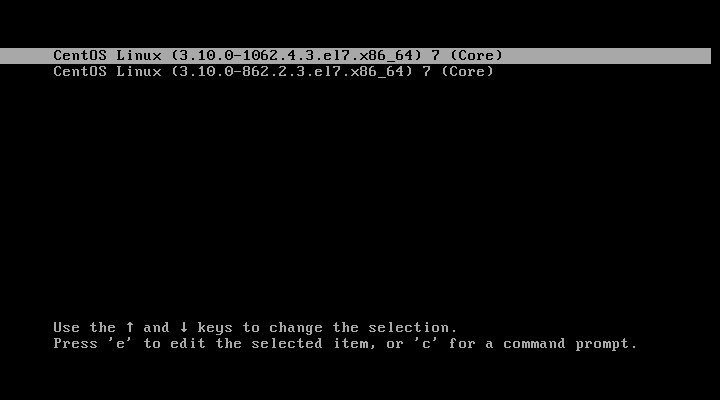
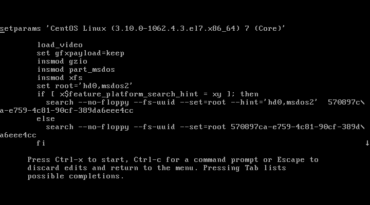

## Занятие 7. Загрузка системы  
### Содержание
1. [Описание занятия](#description)  
2. [Домашнее задание](#homework)  
3. [Справочная информация](#info)  
4. [Выполнение](#exec)  
    - [Вход в систему без пароля](#nopass)
    - [LVM, переименование VG](#lvm)
    - [Добавление модуля в initrd](#initrd)       

## 1. Описание занятия <a name="description"></a>
### Цели
- загрузка системы;  
- разница между `BIOS`/`UEFI`;  
- знакомство с `GRUB2` и его настройка;    
- управление `initrd` с помощью `dracut`;  
- восстановление сломанного загрузчика.  

### Краткое содержание    
- порядок загрузки системы;  
- `GRUB 2`;  
- параметры ядра;  
- `initrd`;  
- `dracut`.  

### Результаты  
Студент может сконфигурировать `GRUB2`, изменить порядок и параметры загрузки.

## 2. Домашнее задание  <a name="homework"></a>
### Постановка задачи  
Работа с загрузчиком
1) Попасть в систему без пароля несколькими способами.  
2) Установить систему с `LVM`, после чего переименовать `VG`.  
3) Добавить модуль в `initrd`.  
4) Сконфигурировать систему без отдельного раздела `/boot`, а только с `LVM`.  
[Репозиторий](https://yum.rumyantsev.com/centos/7/x86_64/) с пропатченным `GRUB2`.  
`PV` необходимо инициализировать с параметром `--bootloaderareasize 1m`.  

Описать действия, описать разницу между методами получения шелла в процессе загрузки.  
Где получится - используем script, где не получается - словами или копипастой описываем действия. 

## 3. Справочная информация <a name="info"></a>  

Упрощенная схема процесса загрузки:  
1) Система BIOS или прошивка загрузки загружают и запускают загрузчик системы.  
2) Загрузчик системы отыскивает образ ядра на диске, загружает его в память и запускает.  
3) Ядро выполняет инициализацию устройств и их драйверов.  
4) Ядро монтирует корневую файловую систему.  
5) Ядро запускает команду `init` с идентификатором процесса 1. Эта точка является началом пространства пользователя.  
6) Команда `init` приводит в действие остальные системные процессы.  
7) В определенный момент команда `init` запускает процесс, позволяющий войти в систему.

`dmesg` — это утилита для просмтра и управления кольцевым буфером ядра.


Параметры ядра при загрузке системы можно увидеть так:
```bash
cat /proc/cmdline
```
```console
BOOT_IMAGE=/boot/vmlinuz-3.10.0-957.12.2.el7.x86_64 root=UUID=8ac075e3-1124-4bb6-bef7-a6811bf8b870 ro no_timer_check console=tty0 console=ttyS0,115200n8 net.ifnames=0 biosdevname=0 elevator=noop crashkernel=auto LANG=en_US.UTF-8
```

#### Начальная файловая система
Загрузчик системы загружает архив с модулями драйверов для контроллеров устройств хранения данных в память перед запуском ядра. Во время запуска ядро считывает содержимое архива во временную файловую систему оперативной памяти ( `initramfs` ), монтирует ее в корневой каталог и в пользовательском режиме выполняет передачу управления команде `init` в файловой системе `initramfs`. Затем включенные в состав `initramfs` утилиты позволяют ядру загрузить необходимые модули драйверов для реальной корневой файловой системы. Наконец, утилиты монтируют реальную корневую файловую систему и запускают настоящую команду `init`.

- `initramfs`, начальная файловая система оперативной памяти — реализация, которая использует архив `cpio` в качестве источника для временной файловой системы.  
- `initrd`, начальный диск оперативной памяти — устаревшая реализация, которая применяет образ диска в качестве основы для временной файловой системы.

## 4. Выполнение <a name="exec"></a>  


### Вход в систему без пароля  <a name="nopass"></a>  

  
  

#### Способ 1. init=/bin/sh
В конце строки начинающейся с linux16 добавляем init=/bin/sh и нажимаем сtrl-x для загрузки в систему.  

В целом на этом все, Вы попали в систему. Но есть один нюанс. Рутовая файловая система при этом монтируется в режиме Read-Only. Если вы хотите перемонтировать ее в режим Read-Write можно воспользоваться командой:
```bash
mount -o remount,rw /
```
После чего можно убедиться записав данные в любой файл или прочитав вывод команды:
```bash
mount | grep root
```

[Red Hat Documentation](https://access.redhat.com/documentation/en-us/red_hat_enterprise_linux/7/html/system_administrators_guide/sec-terminal_menu_editing_during_boot#sec-Changing_and_Resetting_the_Root_Password)

### LVM, переименование VG  <a name="lvm"></a>  

### Добавление модуля в initrd  <a name="initrd"></a>  
