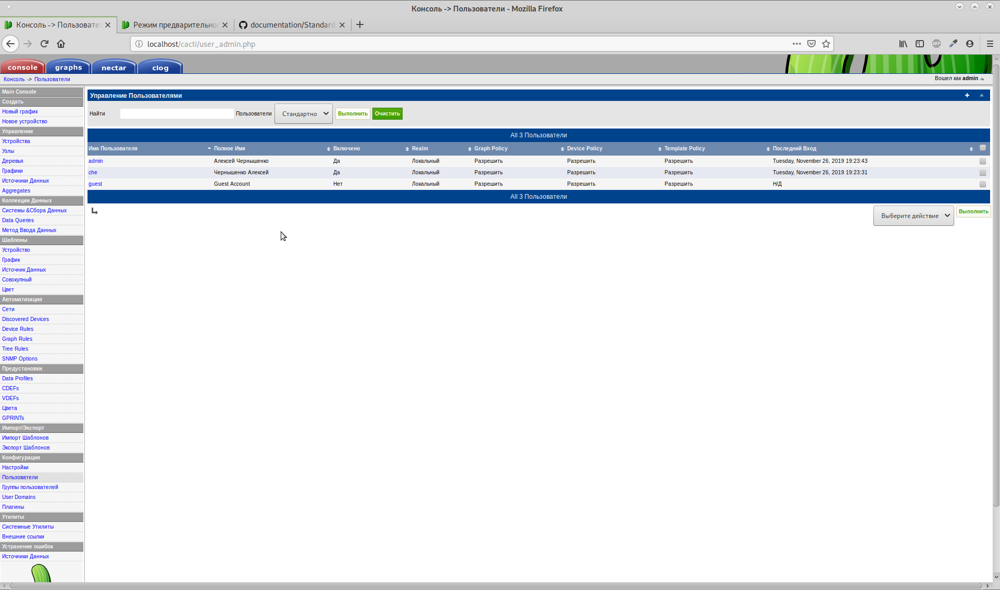
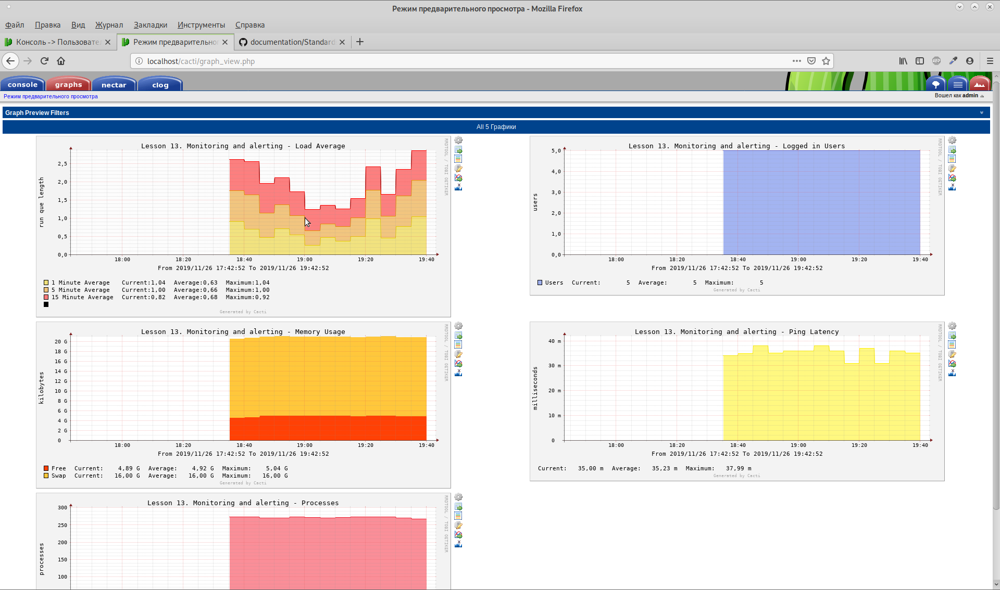
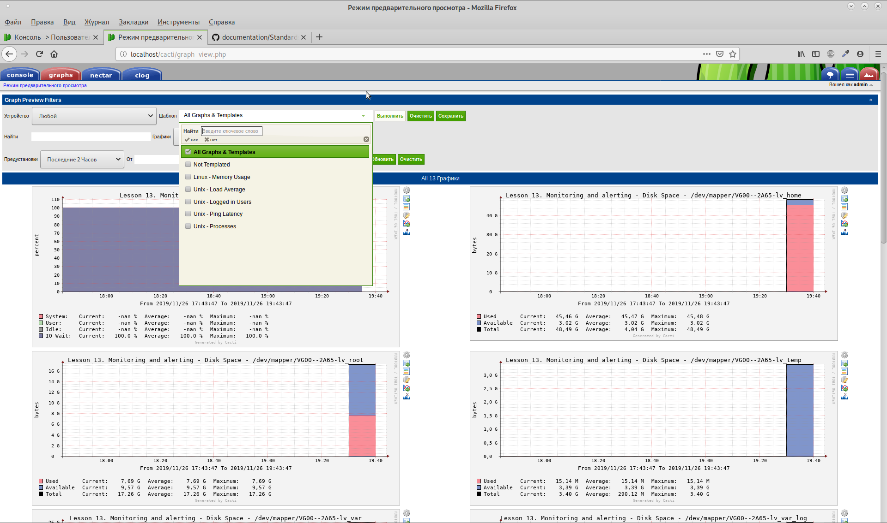

## Занятие 13. Мониторинг и алертинг
### Содержание
1. [Описание занятия](#description)  
2. [Домашнее задание](#homework)  
3. [Выполнение](#exec)  

## 1. Описание занятия 
### Цели
- Изучаем `Zabbix`.
- Знакомимся с `Prometheus`.  

## 2. Домашнее задание  
### Постановка задачи
Настроить дашборд с 4-мя графиками:  
- память,  
- процессор,  
- диск,  
- сеть.

Настроить на одной из систем:  
- `Zabbix` (использовать screen (комплексный экран)),  
- `Prometheus` - `Grafana`.  
В качестве результата прислать скриншот экрана - дашборд должен содержать в названии имя приславшего.  

### Дополнительно
Использовать системы, примеры которых не рассматривались на занятии, список возможных систем был приведен в презентации.  

### Критерии оценки  
5 - основное задание,  
6 - дополнительное задание.  

## 3. Выполнение   
### Cacti
Официальный сайт `Cacti` — [ссылка](https://www.cacti.net/)  
Документация на `GitHub` — [ссылка](https://github.com/cacti/documentation)

​
​
​

### Zabbix
Официальный сайт `Zabbix` — [ссылка](https://www.zabbix.com/ru/)  
Официальная документация — [ссылка](https://www.zabbix.com/documentation/current/ru/manual)  

​

    

### Ссылки

[Grafana](https://grafana.com/) —  
[Icinga](https://icinga.com/products/user-experience/) —  
[Prometheus](https://prometheus.io/) —  

