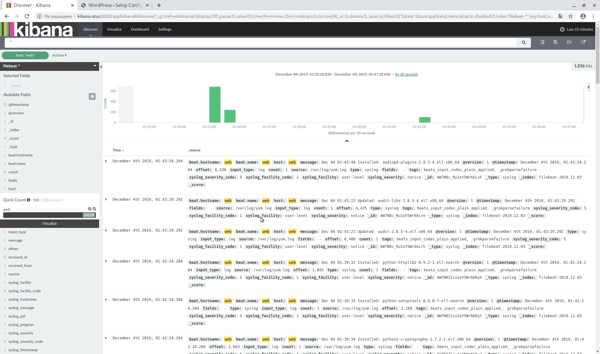
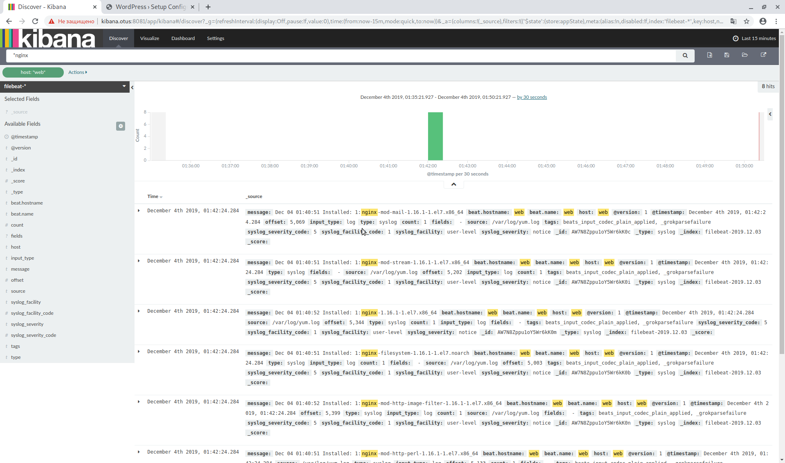

## Занятие 16. Сбор и анализ логов
### Содержание
1. [Описание занятия](#description)  
2. [Домашнее задание](#homework)  
3. [Выполнение](#exec)  

## 1. Описание занятия <a name="description"></a>
### Цели
- разбираем настройку логирования с помощью `rsyslog` и `logrotate`;  
- знакомимся с модными системами логирования - `ELK`, `graylog`.  

## 2. Домашнее задание  <a name="homework"></a>
### Постановка задачи
Настраиваем центральный сервер для сбора логов.  
- в Вагранте поднимаем 2 машины: `web` и `log`,  
- на `web` поднимаем `nginx`,  
- на `log` настраиваем центральный лог-сервер на любой из систем (`journald`, `rsyslog`, `ELK`),  
- настраиваем аудит, следящий за изменением конфигов `nginx`,  
- все критичные логи с `web` должны собираться и локально и удаленно,  
- все логи с `nginx` должны уходить на удаленный сервер (локально только критичные),  
- логи аудита должны также уходить на удаленную систему.  

### Дополнительное задание
- развернуть еще машину `ELK`и таким образом настроить 2 центральных лог-системы (`ELK` и какую-либо еще);  
- в `ELK` должны уходить только логи `nginx`;  
- во вторую систему -- все остальное.  

### Критерии оценки
4 - если присылают только логи и скриншоты, без вагранта,  
5 - за полную настройку,  
6 - если выполнено задание со звездочкой.  

## 3. Выполнение <a name="exec"></a>  
#### Описание стенда

Лабораторный стенд состоит из 3-х виртуальных машин:
- `elk` — сервер `ELK Stack`, веб-сервер `nginx` с предустановленным wordpress.  ;  
- `log` — `rsyslog`-сервер, `ansible`-сервер;  
- `web` — веб-сервер `nginx` с предустановленным wordpress.  

После развертывания стенда из [Vagrantfile](https://github.com/che-a/OTUS_LinuxAdministrator/blob/master/tasks/16/Vagrantfile) необходимо из сервера `log` запустить `ansible`-сценарий:

```bash
vagrant ssh log
```
```bash
cd ansible-log && ansible-playbook playbooks/expand_stand_les16.yml
```
Для доступа к веб-интерфейсу `Kibana` необходимо добавить на локальной машине следующую запись в `/etc/hosts`:
```console
127.0.0.1    wp.otus kibanа.otus
```
`http://kibana.otus:8081/` — веб-интерфейс `Kibana` на виртуальной машине `elk`;  
`http://wp.otus:8081/` — wordpress на виртуальной машине `elk`;  
`http://wp.otus:8082/` — wordpress на виртуальной машине `web`.  

#### Результаты работы
Собранные логи с машин стенда группируются в отдельные каталоги по названию каждой из этих машин:  
```bash
tree -L 2 /var/log/rsyslog
```
```console
.
|-- elk
|   `-- nginx.log
|-- log
|   |-- ansible-command.log
|   |-- ansible-yum.log
|   |-- audispd.log
|   |-- auditd.log
|   |-- augenrules.log
|   |-- kernel.log
|   |-- rsyslogd.log
|   |-- sudo.log
|   |-- systemd.log
|   `-- yum.log
`-- web
    |-- ansible-command.log
    |-- ansible-yum.log
    |-- audispd.log
    |-- auditd.log
    |-- augenrules.log
    |-- kernel.log
    |-- nginx.log
    |-- polkitd.log
    |-- rsyslogd.log
    |-- sshd.log
    |-- sudo.log
    |-- systemd-logind.log
    |-- systemd.log
    `-- yum.log
```

​
​
