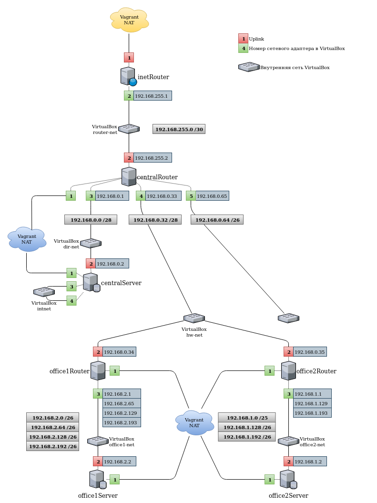

## Занятие 18. Архитектура сетей
### Содержание
1. [Описание занятия](#description)  
2. [Домашнее задание](#homework)  
3. [Справочные сведения](#info)
4. [Выполнение](#exec)  

## 1. Описание занятия <a name="description"></a>
### Цели
- Обзор модели `OSI`;  
- протоколы `ARP`, `IP`, `TCP/UDP`, протоколы прикладного уровня;  
- сетевые интерфейсы в Linux;  
- команды `ip`, `tc`, `ss`, `nstat`, `ifconfig`, `netstat`, `route`;  
- заглянем в `/etc/sysconfig/network-scripts`, поснифферим через `tcpdump` и `ngrep`.  

### Краткое содержание
- Модель `OSI`;  
- Инкапсуляция;  
- `ARP`;  
- `IP`;  
- `TCP`;  
- `UDP`;  

### Результаты
- после занятия участники смогу рассказать о сетевой модели `OSI` и о протоколах каждого ее уровня.  
- также смогут настроить сетевой интерфейс на отдельно взятой машине, сменить IP адрес, подсеть, прописать маршрут.  

## 2. Домашнее задание  <a name="homework"></a>
### Постановка задачи
Разворачиваем сетевую лабораторию.  
Дано: Vagrantfile с начальным построением сети:  
- inetRouter  
- centralRouter  
- centralServer  

Необходимо построить следующую архитектуру:  
Сеть office1  
- 192.168.2.0/26 - dev  
- 192.168.2.64/26 - test servers  
- 192.168.2.128/26 - managers  
- 192.168.2.192/26 - office hardware  

Сеть office2  
- 192.168.1.0/25 - dev  
- 192.168.1.128/26 - test servers  
- 192.168.1.192/26 - office hardware  

Сеть central  
- 192.168.0.0/28 - directors  
- 192.168.0.32/28 - office hardware  
- 192.168.0.64/26 - wifi  

```
Office1 ---\
-----> Central --IRouter --> internet
Office2----/
```
Итого должны получится следующие сервера
- inetRouter
- centralRouter
- office1Router
- office2Router
- centralServer
- office1Server
- office2Server

Теоретическая часть:  
- Найти свободные подсети.  
- Посчитать сколько узлов в каждой подсети, включая свободные.  
- Указать broadcast адрес для каждой подсети.  
- проверить нет ли ошибок при разбиении.  

Практическая часть:  
- Соединить офисы в сеть согласно схеме и настроить роутинг.  
- Все сервера и роутеры должны ходить в инет черз inetRouter.  
- Все сервера должны видеть друг друга.  
- у всех новых серверов отключить дефолт на нат (eth0), который вагрант поднимает для связи.  
- при нехватке сетевых интервейсов добавить по несколько адресов на интерфейс.  

### Критерии оценки
4 - сделана хотя бы часть,  
5 - сделано всё.  

## 3. Справочные сведения <a name="info"></a>  

<details>
    <summary>Деление сети 192.168.0.0/24 на подсети</summary>

```console
+----------------+------------------+------------------+------------------+------------------+------------------+
|                |                  |                  |                  |                  | 192.168.0.0/29   |
|                |                  |                  |                  | 192.168.0.0/28   +------------------+
|                |                  |                  |                  |                  | 192.168.0.8/29   |
|                |                  |                  | 192.168.0.0/27   +------------------+------------------+
|                |                  |                  |                  |                  | 192.168.0.16/29  |
|                |                  |                  |                  | 192.168.0.16/28  +------------------+
|                |                  |                  |                  |                  | 192.168.0.24/29  |
|                |                  | 192.168.0.0/26   +------------------+------------------+------------------+
|                |                  |                  |                  |                  | 192.168.0.32/29  |
|                |                  |                  |                  | 192.168.0.32/28  +------------------+
|                |                  |                  |                  |                  | 192.168.0.40/29  |
|                |                  |                  | 192.168.0.32/27  +------------------+------------------+
|                |                  |                  |                  |                  | 192.168.0.48/29  |
|                |                  |                  |                  | 192.168.0.48/28  +------------------+
|                |                  |                  |                  |                  | 192.168.0.56/29  |
|                | 192.168.0.0/25   +------------------+------------------+------------------+------------------+
|                |                  |                  |                  |                  | 192.168.0.64/29  |
|                |                  |                  |                  | 192.168.0.64/28  +------------------+
|                |                  |                  |                  |                  | 192.168.0.72/29  |
|                |                  |                  | 192.168.0.64/27  +------------------+------------------+
|                |                  |                  |                  |                  | 192.168.0.80/29  |
|                |                  |                  |                  | 192.168.0.80/28  +------------------+
|                |                  |                  |                  |                  | 192.168.0.88/29  |
|                |                  | 192.168.0.64/26  +------------------+------------------+------------------+
|                |                  |                  |                  |                  | 192.168.0.96/29  |
|                |                  |                  |                  | 192.168.0.96/28  +------------------+
|                |                  |                  |                  |                  | 192.168.0.104/29 |
|                |                  |                  | 192.168.0.96/27  +------------------+------------------+
|                |                  |                  |                  |                  | 192.168.0.112/29 |
|                |                  |                  |                  | 192.168.0.112/28 +------------------+
|                |                  |                  |                  |                  | 192.168.0.120/29 |
| 192.168.0.0/24 +------------------+------------------+------------------+------------------+------------------+
|                |                  |                  |                  |                  | 192.168.0.128/29 |
|                |                  |                  |                  | 192.168.0.128/28 +------------------+
|                |                  |                  |                  |                  | 192.168.0.136/29 |
|                |                  |                  | 192.168.0.128/27 +------------------+------------------+
|                |                  |                  |                  |                  | 192.168.0.144/29 |
|                |                  |                  |                  | 192.168.0.144/28 +------------------+
|                |                  |                  |                  |                  | 192.168.0.152/29 |
|                |                  | 192.168.0.128/26 +------------------+------------------+------------------+
|                |                  |                  |                  |                  | 192.168.0.160/29 |
|                |                  |                  |                  | 192.168.0.160/28 +------------------+
|                |                  |                  |                  |                  | 192.168.0.168/29 |
|                |                  |                  | 192.168.0.160/27 +------------------+------------------+
|                |                  |                  |                  |                  | 192.168.0.176/29 |
|                |                  |                  |                  | 192.168.0.176/28 +------------------+
|                |                  |                  |                  |                  | 192.168.0.184/29 |
|                | 192.168.0.128/25 +------------------+------------------+------------------+------------------+
|                |                  |                  |                  |                  | 192.168.0.192/29 |
|                |                  |                  |                  | 192.168.0.192/28 +------------------+
|                |                  |                  |                  |                  | 192.168.0.200/29 |
|                |                  |                  | 192.168.0.192/27 +------------------+------------------+
|                |                  |                  |                  |                  | 192.168.0.208/29 |
|                |                  |                  |                  | 192.168.0.208/28 +------------------+
|                |                  |                  |                  |                  | 192.168.0.216/29 |
|                |                  | 192.168.0.192/26 +------------------+------------------+------------------+
|                |                  |                  |                  |                  | 192.168.0.224/29 |
|                |                  |                  |                  | 192.168.0.224/28 +------------------+
|                |                  |                  |                  |                  | 192.168.0.232/29 |
|                |                  |                  | 192.168.0.224/27 +------------------+------------------+
|                |                  |                  |                  |                  | 192.168.0.240/29 |
|                |                  |                  |                  | 192.168.0.240/28 +------------------+
|                |                  |                  |                  |                  | 192.168.0.248/29 |
+----------------+------------------+------------------+------------------+------------------+------------------+
```

</details>

<details>
    <summary>Маски подсетей сети 192.168.0.0/24</summary>

```console
+---------------+------+------+------+------+------+------+-----+
| 192.168.0.0   |      |      |      |      |      |      |     |
| 192.168.0.1   | /30  |      |      |      |      |      |     |
| 192.168.0.2   | .252 |      |      |      |      |      |     |
| 192.168.0.3   |      |      |      |      |      |      |     |
+---------------+------+ /29  |      |      |      |      |     |
| 192.168.0.4   |      | .248 |      |      |      |      |     |
| 192.168.0.5   | /30  |      |      |      |      |      |     |
| 192.168.0.6   | .252 |      |      |      |      |      |     |
| 192.168.0.7   |      |      |      |      |      |      |     |
+---------------+------+------+ /28  |      |      |      |     |
| 192.168.0.8   |      |      | .240 |      |      |      |     |
| 192.168.0.9   | /30  |      |      |      |      |      |     |
| 192.168.0.10  | .252 |      |      |      |      |      |     |
| 192.168.0.11  |      |      |      |      |      |      |     |
+---------------+------+ /29  |      |      |      |      |     |
| 192.168.0.12  |      | .248 |      |      |      |      |     |
| 192.168.0.13  | /30  |      |      |      |      |      |     |
| 192.168.0.14  | .252 |      |      |      |      |      |     |
| 192.168.0.15  |      |      |      |      |      |      |     |
+---------------+------+------+------+ /27  |      |      |     |
| 192.168.0.16  |      |      |      | .224 |      |      |     |
| 192.168.0.17  | /30  |      |      |      |      |      |     |
| 192.168.0.18  | .252 |      |      |      |      |      |     |
| 192.168.0.19  |      |      |      |      |      |      |     |
+---------------+------+ /29  |      |      |      |      |     |
| 192.168.0.20  |      | .248 |      |      |      |      |     |
| 192.168.0.21  | /30  |      |      |      |      |      |     |
| 192.168.0.22  | .252 |      |      |      |      |      |     |
| 192.168.0.23  |      |      |      |      |      |      |     |
+---------------+------+------+ /28  |      |      |      |     |
| 192.168.0.24  |      |      | .240 |      |      |      |     |
| 192.168.0.25  | /30  |      |      |      |      |      |     |
| 192.168.0.26  | .252 |      |      |      |      |      |     |
| 192.168.0.27  |      |      |      |      |      |      |     |
+---------------+------+ /29  |      |      |      |      |     |
| 192.168.0.28  |      | .248 |      |      |      |      |     |
| 192.168.0.29  | /30  |      |      |      |      |      |     |
| 192.168.0.30  | .252 |      |      |      |      |      |     |
| 192.168.0.31  |      |      |      |      |      |      |     |
+---------------+------+------+------+------+ /26  |      |     |
| 192.168.0.32  |      |      |      |      | .192 |      |     |
| 192.168.0.33  | /30  |      |      |      |      |      |     |
| 192.168.0.34  | .252 |      |      |      |      |      |     |
| 192.168.0.35  |      |      |      |      |      |      |     |
+---------------+------+ /29  |      |      |      |      |     |
| 192.168.0.36  |      | .248 |      |      |      |      |     |
| 192.168.0.37  | /30  |      |      |      |      |      |     |
| 192.168.0.38  | .252 |      |      |      |      |      |     |
| 192.168.0.39  |      |      |      |      |      |      |     |
+---------------+------+------+ /28  |      |      |      |     |
| 192.168.0.40  |      |      | .240 |      |      |      |     |
| 192.168.0.41  | /30  |      |      |      |      |      |     |
| 192.168.0.42  | .252 |      |      |      |      |      |     |
| 192.168.0.43  |      |      |      |      |      |      |     |
+---------------+------+ /29  |      |      |      |      |     |
| 192.168.0.44  |      | .248 |      |      |      |      |     |
| 192.168.0.45  | /30  |      |      |      |      |      |     |
| 192.168.0.46  | .252 |      |      |      |      |      |     |
| 192.168.0.47  |      |      |      |      |      |      |     |
+---------------+------+------+------+ /27  |      |      |     |
| 192.168.0.48  |      |      |      | .224 |      |      |     |
| 192.168.0.49  | /30  |      |      |      |      |      |     |
| 192.168.0.50  | .252 |      |      |      |      |      |     |
| 192.168.0.51  |      |      |      |      |      |      |     |
+---------------+------+ /29  |      |      |      |      |     |
| 192.168.0.52  |      | .248 |      |      |      |      |     |
| 192.168.0.53  | /30  |      |      |      |      |      |     |
| 192.168.0.54  | .252 |      |      |      |      |      |     |
| 192.168.0.55  |      |      |      |      |      |      |     |
+---------------+------+------+ /28  |      |      |      |     |
| 192.168.0.56  |      |      | .240 |      |      |      |     |
| 192.168.0.57  | /30  |      |      |      |      |      |     |
| 192.168.0.58  | .252 |      |      |      |      |      |     |
| 192.168.0.59  |      |      |      |      |      |      |     |
+---------------+------+ /29  |      |      |      |      |     |
| 192.168.0.60  |      | .248 |      |      |      |      |     |
| 192.168.0.61  | /30  |      |      |      |      |      |     |
| 192.168.0.62  | .252 |      |      |      |      |      |     |
| 192.168.0.63  |      |      |      |      |      |      |     |
+---------------+------+------+------+------+------+ /25  |     |
| 192.168.0.64  |      |      |      |      |      | .128 |     |
| 192.168.0.65  | /30  |      |      |      |      |      |     |
| 192.168.0.66  | .252 |      |      |      |      |      |     |
| 192.168.0.67  |      |      |      |      |      |      |     |
+---------------+------+ /29  |      |      |      |      |     |
| 192.168.0.68  |      | .248 |      |      |      |      |     |
| 192.168.0.69  | /30  |      |      |      |      |      |     |
| 192.168.0.70  | .252 |      |      |      |      |      |     |
| 192.168.0.71  |      |      |      |      |      |      |     |
+---------------+------+------+ /28  |      |      |      |     |
| 192.168.0.72  |      |      | .240 |      |      |      |     |
| 192.168.0.73  | /30  |      |      |      |      |      |     |
| 192.168.0.74  | .252 |      |      |      |      |      |     |
| 192.168.0.75  |      |      |      |      |      |      |     |
+---------------+------+ /29  |      |      |      |      |     |
| 192.168.0.76  |      | .248 |      |      |      |      |     |
| 192.168.0.77  | /30  |      |      |      |      |      |     |
| 192.168.0.78  | .252 |      |      |      |      |      |     |
| 192.168.0.79  |      |      |      |      |      |      |     |
+---------------+------+------+------+ /27  |      |      |     |
| 192.168.0.80  |      |      |      | .224 |      |      |     |
| 192.168.0.81  | /30  |      |      |      |      |      |     |
| 192.168.0.82  | .252 |      |      |      |      |      |     |
| 192.168.0.83  |      |      |      |      |      |      |     |
+---------------+------+ /29  |      |      |      |      |     |
| 192.168.0.84  |      | .248 |      |      |      |      |     |
| 192.168.0.85  | /30  |      |      |      |      |      |     |
| 192.168.0.86  | .252 |      |      |      |      |      |     |
| 192.168.0.87  |      |      |      |      |      |      |     |
+---------------+------+------+ /28  |      |      |      |     |
| 192.168.0.88  |      |      | .240 |      |      |      |     |
| 192.168.0.89  | /30  |      |      |      |      |      |     |
| 192.168.0.90  | .252 |      |      |      |      |      |     |
| 192.168.0.91  |      |      |      |      |      |      |     |
+---------------+------+ /29  |      |      |      |      |     |
| 192.168.0.92  |      | .248 |      |      |      |      |     |
| 192.168.0.93  | /30  |      |      |      |      |      |     |
| 192.168.0.94  | .252 |      |      |      |      |      |     |
| 192.168.0.95  |      |      |      |      |      |      |     |
+---------------+------+------+------+------+ /26  |      |     |
| 192.168.0.96  |      |      |      |      | .192 |      |     |
| 192.168.0.97  | /30  |      |      |      |      |      |     |
| 192.168.0.98  | .252 |      |      |      |      |      |     |
| 192.168.0.99  |      |      |      |      |      |      |     |
+---------------+------+ /29  |      |      |      |      |     |
| 192.168.0.100 |      | .248 |      |      |      |      |     |
| 192.168.0.101 | /30  |      |      |      |      |      |     |
| 192.168.0.102 | .252 |      |      |      |      |      |     |
| 192.168.0.103 |      |      |      |      |      |      |     |
+---------------+------+------+ /28  |      |      |      |     |
| 192.168.0.104 |      |      | .240 |      |      |      |     |
| 192.168.0.105 | /30  |      |      |      |      |      |     |
| 192.168.0.106 | .252 |      |      |      |      |      |     |
| 192.168.0.107 |      |      |      |      |      |      |     |
+---------------+------+ /29  |      |      |      |      |     |
| 192.168.0.108 |      | .248 |      |      |      |      |     |
| 192.168.0.109 | /30  |      |      |      |      |      |     |
| 192.168.0.110 | .252 |      |      |      |      |      |     |
| 192.168.0.111 |      |      |      |      |      |      |     |
+---------------+------+------+------+ /27  |      |      |     |
| 192.168.0.112 |      |      |      | .224 |      |      |     |
| 192.168.0.113 | /30  |      |      |      |      |      |     |
| 192.168.0.114 | .252 |      |      |      |      |      |     |
| 192.168.0.115 |      |      |      |      |      |      |     |
+---------------+------+ /29  |      |      |      |      |     |
| 192.168.0.116 |      | .248 |      |      |      |      |     |
| 192.168.0.117 | /30  |      |      |      |      |      |     |
| 192.168.0.118 | .252 |      |      |      |      |      |     |
| 192.168.0.119 |      |      |      |      |      |      |     |
+---------------+------+------+ /28  |      |      |      |     |
| 192.168.0.120 |      |      | .240 |      |      |      |     |
| 192.168.0.121 | /30  |      |      |      |      |      |     |
| 192.168.0.122 | .252 |      |      |      |      |      |     |
| 192.168.0.123 |      |      |      |      |      |      |     |
+---------------+------+ /29  |      |      |      |      |     |
| 192.168.0.124 |      | .248 |      |      |      |      |     |
| 192.168.0.125 | /30  |      |      |      |      |      |     |
| 192.168.0.126 | .252 |      |      |      |      |      |     |
| 192.168.0.127 |      |      |      |      |      |      |     |
+---------------+------+------+------+------+------+------+ /24 |
| 192.168.0.128 |      |      |      |      |      |      | .0  |
| 192.168.0.129 | /30  |      |      |      |      |      |     |
| 192.168.0.130 | .252 |      |      |      |      |      |     |
| 192.168.0.131 |      |      |      |      |      |      |     |
+---------------+------+ /29  |      |      |      |      |     |
| 192.168.0.132 |      | .248 |      |      |      |      |     |
| 192.168.0.133 | /30  |      |      |      |      |      |     |
| 192.168.0.134 | .252 |      |      |      |      |      |     |
| 192.168.0.135 |      |      |      |      |      |      |     |
+---------------+------+------+ /28  |      |      |      |     |
| 192.168.0.136 |      |      | .240 |      |      |      |     |
| 192.168.0.137 | /30  |      |      |      |      |      |     |
| 192.168.0.138 | .252 |      |      |      |      |      |     |
| 192.168.0.139 |      |      |      |      |      |      |     |
+---------------+------+ /29  |      |      |      |      |     |
| 192.168.0.140 |      | .248 |      |      |      |      |     |
| 192.168.0.141 | /30  |      |      |      |      |      |     |
| 192.168.0.142 | .252 |      |      |      |      |      |     |
| 192.168.0.143 |      |      |      |      |      |      |     |
+---------------+------+------+------+ /27  |      |      |     |
| 192.168.0.144 |      |      |      | .224 |      |      |     |
| 192.168.0.145 | /30  |      |      |      |      |      |     |
| 192.168.0.146 | .252 |      |      |      |      |      |     |
| 192.168.0.147 |      |      |      |      |      |      |     |
+---------------+------+ /29  |      |      |      |      |     |
| 192.168.0.148 |      | .248 |      |      |      |      |     |
| 192.168.0.149 | /30  |      |      |      |      |      |     |
| 192.168.0.150 | .252 |      |      |      |      |      |     |
| 192.168.0.151 |      |      |      |      |      |      |     |
+---------------+------+------+ /28  |      |      |      |     |
| 192.168.0.152 |      |      | .240 |      |      |      |     |
| 192.168.0.153 | /30  |      |      |      |      |      |     |
| 192.168.0.154 | .252 |      |      |      |      |      |     |
| 192.168.0.155 |      |      |      |      |      |      |     |
+---------------+------+ /29  |      |      |      |      |     |
| 192.168.0.156 |      | .248 |      |      |      |      |     |
| 192.168.0.157 | /30  |      |      |      |      |      |     |
| 192.168.0.158 | .252 |      |      |      |      |      |     |
| 192.168.0.159 |      |      |      |      |      |      |     |
+---------------+------+------+------+------+ /26  |      |     |
| 192.168.0.160 |      |      |      |      | .192 |      |     |
| 192.168.0.161 | /30  |      |      |      |      |      |     |
| 192.168.0.162 | .252 |      |      |      |      |      |     |
| 192.168.0.163 |      |      |      |      |      |      |     |
+---------------+------+ /29  |      |      |      |      |     |
| 192.168.0.164 |      | .248 |      |      |      |      |     |
| 192.168.0.165 | /30  |      |      |      |      |      |     |
| 192.168.0.166 | .252 |      |      |      |      |      |     |
| 192.168.0.167 |      |      |      |      |      |      |     |
+---------------+------+------+ /28  |      |      |      |     |
| 192.168.0.168 |      |      | .240 |      |      |      |     |
| 192.168.0.169 | /30  |      |      |      |      |      |     |
| 192.168.0.170 | .252 |      |      |      |      |      |     |
| 192.168.0.171 |      |      |      |      |      |      |     |
+---------------+------+ /29  |      |      |      |      |     |
| 192.168.0.172 |      | .248 |      |      |      |      |     |
| 192.168.0.173 | /30  |      |      |      |      |      |     |
| 192.168.0.174 | .252 |      |      |      |      |      |     |
| 192.168.0.175 |      |      |      |      |      |      |     |
+---------------+------+------+------+ /27  |      |      |     |
| 192.168.0.176 |      |      |      | .224 |      |      |     |
| 192.168.0.177 | /30  |      |      |      |      |      |     |
| 192.168.0.178 | .252 |      |      |      |      |      |     |
| 192.168.0.179 |      |      |      |      |      |      |     |
+---------------+------+ /29  |      |      |      |      |     |
| 192.168.0.180 |      | .248 |      |      |      |      |     |
| 192.168.0.182 | .252 |      |      |      |      |      |     |
| 192.168.0.181 | /30  |      |      |      |      |      |     |
| 192.168.0.183 |      |      |      |      |      |      |     |
+---------------+------+------+ /28  |      |      |      |     |
| 192.168.0.184 |      |      | .240 |      |      |      |     |
| 192.168.0.185 | /30  |      |      |      |      |      |     |
| 192.168.0.186 | .252 |      |      |      |      |      |     |
| 192.168.0.187 |      |      |      |      |      |      |     |
+---------------+------+ /29  |      |      |      |      |     |
| 192.168.0.188 |      | .248 |      |      |      |      |     |
| 192.168.0.189 | /30  |      |      |      |      |      |     |
| 192.168.0.190 | .252 |      |      |      |      |      |     |
| 192.168.0.191 |      |      |      |      |      |      |     |
+---------------+------+------+------+------+------+ /25  |     |
| 192.168.0.192 |      |      |      |      |      | .128 |     |
| 192.168.0.193 | /30  |      |      |      |      |      |     |
| 192.168.0.194 | .252 |      |      |      |      |      |     |
| 192.168.0.195 |      |      |      |      |      |      |     |
+---------------+------+ /29  |      |      |      |      |     |
| 192.168.0.196 |      | .248 |      |      |      |      |     |
| 192.168.0.197 | /30  |      |      |      |      |      |     |
| 192.168.0.198 | .252 |      |      |      |      |      |     |
| 192.168.0.199 |      |      |      |      |      |      |     |
+---------------+------+------+ /28  |      |      |      |     |
| 192.168.0.200 |      |      | .240 |      |      |      |     |
| 192.168.0.201 | /30  |      |      |      |      |      |     |
| 192.168.0.202 | .252 |      |      |      |      |      |     |
| 192.168.0.203 |      |      |      |      |      |      |     |
+---------------+------+ /29  |      |      |      |      |     |
| 192.168.0.204 |      | .248 |      |      |      |      |     |
| 192.168.0.205 | /30  |      |      |      |      |      |     |
| 192.168.0.206 | .252 |      |      |      |      |      |     |
| 192.168.0.207 |      |      |      |      |      |      |     |
+---------------+------+------+------+ /27  |      |      |     |
| 192.168.0.208 |      |      |      | .224 |      |      |     |
| 192.168.0.209 | /30  |      |      |      |      |      |     |
| 192.168.0.210 | .252 |      |      |      |      |      |     |
| 192.168.0.211 |      |      |      |      |      |      |     |
+---------------+------+ /29  |      |      |      |      |     |
| 192.168.0.212 |      | .248 |      |      |      |      |     |
| 192.168.0.213 | .252 |      |      |      |      |      |     |
| 192.168.0.214 | /30  |      |      |      |      |      |     |
| 192.168.0.215 |      |      |      |      |      |      |     |
+---------------+------+------+ /28  |      |      |      |     |
| 192.168.0.216 |      |      | .240 |      |      |      |     |
| 192.168.0.217 | /30  |      |      |      |      |      |     |
| 192.168.0.218 | .252 |      |      |      |      |      |     |
| 192.168.0.219 |      |      |      |      |      |      |     |
+---------------+------+ /29  |      |      |      |      |     |
| 192.168.0.220 |      | .248 |      |      |      |      |     |
| 192.168.0.221 | /30  |      |      |      |      |      |     |
| 192.168.0.222 | .252 |      |      |      |      |      |     |
| 192.168.0.223 |      |      |      |      |      |      |     |
+---------------+------+------+------+------+ /26  |      |     |
| 192.168.0.224 |      |      |      |      | .192 |      |     |
| 192.168.0.225 | /30  |      |      |      |      |      |     |
| 192.168.0.226 | .252 |      |      |      |      |      |     |
| 192.168.0.227 |      |      |      |      |      |      |     |
+---------------+------+ /29  |      |      |      |      |     |
| 192.168.0.228 |      | .248 |      |      |      |      |     |
| 192.168.0.229 | /30  |      |      |      |      |      |     |
| 192.168.0.230 | .252 |      |      |      |      |      |     |
| 192.168.0.231 |      |      |      |      |      |      |     |
+---------------+------+------+ /28  |      |      |      |     |
| 192.168.0.232 |      |      | .240 |      |      |      |     |
| 192.168.0.233 | /30  |      |      |      |      |      |     |
| 192.168.0.234 | .252 |      |      |      |      |      |     |
| 192.168.0.235 |      |      |      |      |      |      |     |
+---------------+------+ /29  |      |      |      |      |     |
| 192.168.0.236 |      | .248 |      |      |      |      |     |
| 192.168.0.237 | /30  |      |      |      |      |      |     |
| 192.168.0.238 | .252 |      |      |      |      |      |     |
| 192.168.0.239 |      |      |      |      |      |      |     |
+---------------+------+------+------+ /27  |      |      |     |
| 192.168.0.240 |      |      |      | .224 |      |      |     |
| 192.168.0.241 | /30  |      |      |      |      |      |     |
| 192.168.0.242 | .252 |      |      |      |      |      |     |
| 192.168.0.243 |      |      |      |      |      |      |     |
+---------------+------+ /29  |      |      |      |      |     |
| 192.168.0.244 |      | .248 |      |      |      |      |     |
| 192.168.0.245 | /30  |      |      |      |      |      |     |
| 192.168.0.246 | .252 |      |      |      |      |      |     |
| 192.168.0.247 |      |      |      |      |      |      |     |
+---------------+------+------+ /28  |      |      |      |     |
| 192.168.0.248 |      |      | .240 |      |      |      |     |
| 192.168.0.249 | /30  |      |      |      |      |      |     |
| 192.168.0.250 | .252 |      |      |      |      |      |     |
| 192.168.0.251 |      |      |      |      |      |      |     |
+---------------+------+ /29  |      |      |      |      |     |
| 192.168.0.252 |      | .248 |      |      |      |      |     |
| 192.168.0.253 | /30  |      |      |      |      |      |     |
| 192.168.0.254 | .252 |      |      |      |      |      |     |
| 192.168.0.255 |      |      |      |      |      |      |     |
+---------------+------+------+------+------+------+------+-----+
```

</details>


## 4. Выполнение <a name="exec"></a>  
### Теоретическая часть задания

#### Свободные подсети  
- `192.168.0.0/28`   - directors  
- `192.168.0.16/28`  - СВОБОДНАЯ ПОДСЕТЬ  
- `192.168.0.32/28`  - office hardware  
- `192.168.0.48/28`  - СВОБОДНАЯ ПОДСЕТЬ  
- `192.168.0.64/26`  - wifi  
- `192.168.0.128/25` - СВОБОДНАЯ ПОДСЕТЬ  

#### Количество узлов в подсети

| Подсеть | Кол-во IP | Кол-во узлов сети    |
|:----|:----|:-----|
| /24 | 256 | 254 |
| /25 | 128 | 126 |
| /26 | 64  | 62  |
| /27 | 32  | 30  |
| /28 | 16  | 14  |
| /29 | 8   | 6   |
| /30 | 4   | 2   |

#### Broadcast-адреса
| Подсеть | Маска | Широковещательный IP |
|:--------|:------|:---------------------|
| 192.168.0.0   | /28 | 192.168.0.15  |
| 192.168.0.32  | /28 | 192.168.0.47  |
| 192.168.0.64  | /26 | 192.168.0.127 |
| 192.168.1.0   | /25 | 192.168.1.127 |
| 192.168.1.128 | /26 | 192.168.1.191 |
| 192.168.1.192 | /26 | 192.168.1.255 |
| 192.168.2.0   | /26 | 192.168.2.63  |
| 192.168.2.64  | /26 | 192.168.2.127 |
| 192.168.2.128 | /26 | 192.168.2.191 |
| 192.168.2.192 | /26 | 192.168.2.255 |


### Практическая часть задания
#### Описание стенда


